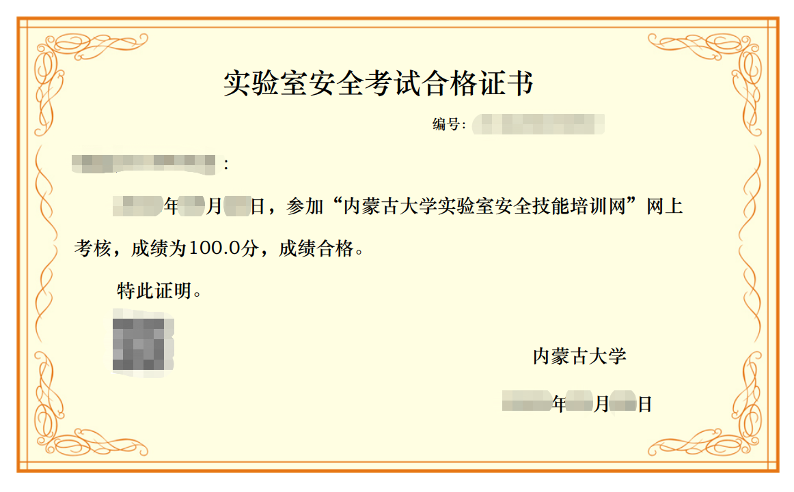

# 内大实验室在线学习自动监控程序

写在前面
-------
本代码为笔者学习动态网络爬虫时练习的小项目，**仅供各位读者学习交流**，**切勿用于违规违法用途**，**不得侵犯任何单位或个人的任何利益**，使用者如开始使用，则默认同意本条款。如果本代码有侵犯任何人的利益，请联系我删除，谢谢。

执行效果
-------

注：本代码只提供刷取时长（第一张图片效果），合格证书需要读者手动考试方可获得。

环境准备
-------
建议使用windows操作系统，笔者是在Python3.7的环境下开发。首先打开命令行：
1. 利用conda创建虚拟环境并激活（如果没有conda或其他虚拟环境管理程序则跳过这步）
```
conda create -n auto python=3.7
conda activate auto
```
2. 安装核心功能包
```
pip install selenium
```


插件准备
-------
* 下载最新版本[谷歌驱动器](https://registry.npmmirror.com/binary.html?path=chromedriver/) 放到data文件夹下, 放完之后应该是这样的。
```
auto.py
card.png
data   
  └── chromedriver.exe
result.png
```

开始执行任务
----------
* 首先克隆本项目在你的电脑上
```
git clone https://github.com/vail-xjl/nd_lab.git
```

* 然后cd至【nd_lab】目录下，然后执行，你需要在-u后指定你的学号，在-p后指定你的教务处登录密码，在-t后指定你要学习的总时长数，默认为8
```
python auto.py -u <student_id> -p <password> -t <learn_time>
```

日志将会在执行完毕后保留到当前目录下【log.txt】


